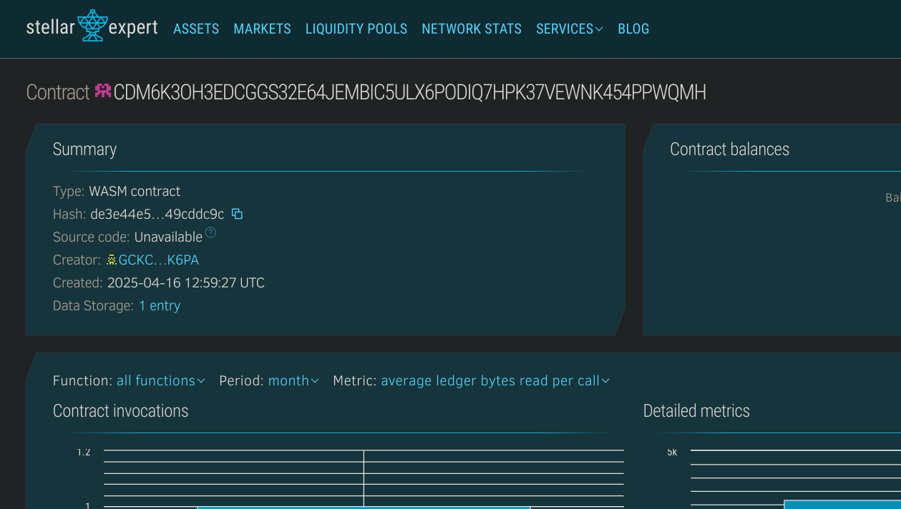

# P2P Crypto Lending App

## 📌 Project Title
**P2P Crypto Lending App**

---

## 📄 Project Description
A decentralized peer-to-peer crypto lending platform where users can request loans, fund loans, and repay them—securely recorded and verified on the Stellar blockchain using Soroban smart contracts.

---

## 🎯 Project Vision
To democratize finance by allowing users to lend and borrow crypto assets without relying on centralized institutions—ensuring security, transparency, and direct ownership over the lending process.

---

## 🚀 Key Features
- 🏦 Request a loan with specific amount and identity
- 💰 Allow lenders to fund active loan requests
- ✅ Enable borrowers to repay loans
- 🔍 Track loan lifecycle: requested, funded, and repaid
- 📜 On-chain transparency and tamper-proof records

---

## 🔮 Future Scope
- 🪙 Integrate token transfers for actual fund movement
- ⏳ Add repayment deadlines and penalties
- 🧠 Add loan scoring and credit logic
- 🤝 Smart dispute resolution and arbitration
- 📱 dApp frontend for mobile/desktop usage

## Contract Details
CDM6K3OH3EDCGGS32E64JEMBIC5ULX6PODIQ7HPK37VEWNK454PPWQMH
